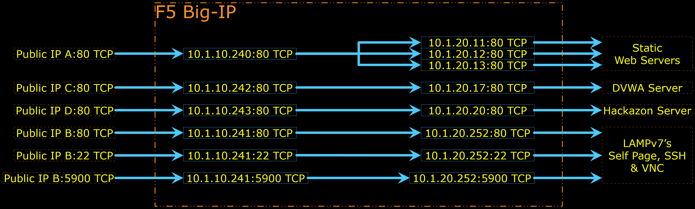

# AS3 LTM Simple (No OutBound)

The diagram below depicts the Logical Configuration Diagram built by this AS3 Declaration.

AS3 Declaration configures only the stuffs inside Big-IP (refer to the diagram above).
Anything outside Big-IP shall be configured by AWS CloudFormation ; or if you use this AS3 Declaration in VE or Hardware; the things outside Big-IP shall be configured separately, either manually or by other scripts or some external orchestrator node.

