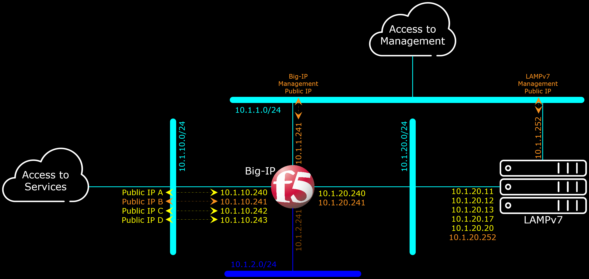
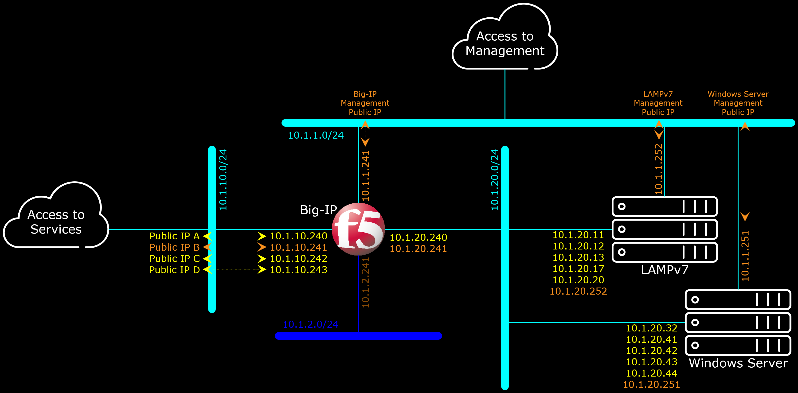

# Big-IP Lab Environment

This repository serves only as journal notes to the [Big-IP Lab](https://github.com/gjwdyk/BigIP-Lab) project.
If you're looking for a CloudFormation template to be used for building Big-IP Lab environment, then kindly refer to [Big-IP Lab](https://github.com/gjwdyk/BigIP-Lab).


## CloudFormation Big-IP LAMPv7


This repository reflects a journey in learning (AWS' CF & F5's AS3) and automating the creation process of F5 Demo environment (vLab section under https://downloads.f5.com/).

The default values in the CloudFormation templates were designed to work in AWS Region Singapore (`ap-southeast-1`).
The reason of that is because the adapted LAMPv7 and Windows Server 2008 R2 VMs are only imported to AWS Region Singapore, so the adapted LAMPv7 and Windows Server 2008 R2 AMIs exist only in AWS Region Singapore.
To make the templates work in any other AWS Regions, the adapted LAMPv7 and Windows Server 2008 R2 AMIs must exist in the targeted region and be accessible by the targeted account, before the execution of the template.
Which can be achieved by re-importing the adapted LAMPv7 and Windows Server 2008 R2 VMs, or by copying the adapted LAMPv7 and Windows Server 2008 R2 AMIs in Singapore to the targeted AWS Region.
Once the adapted LAMPv7 and Windows Server 2008 R2 AMIs exist in the targeted AWS Region, the AMI ID of the adapted LAMPv7 and Windows Server 2008 R2 need to be indicated properly (i.e. not using the default value) during execution of the template.

The Big-IP AMI should be available in most (if not ALL) of AWS Regions as part of F5 Networks effort to sell usage of the product in AWS.
Only the correct AMI ID of Big-IP within the targeted AWS Region is needed, which should not be difficult to find.
You will also need a valid F5 Big-IP License to execute the template and having a running Big-IP Instance.

Note that the CloudFormation templates were tested with various version of Big-IP, from version 15.0.1 build 0.0.11 to version 15.1.2.1 build 0.0.10, depending on when the template was created.
The sections below starts from the first time the template was created. When the template was updated (i.e. by adding features) another section was added below the previous one.
So with the time, naturally the template on the first few sections will be out-dated and MAY not work.

This CloudFormation template is designed for building Demo/Testing environment only. It was NOT designed to be used for Live/Commercial environment!

The whole template require around 30 minutes to fully completed. Although the CloudFormation stack itself stated it has completed, the instances themselves need much more time to self-configure.

The diagram below depicts the Logical Network Diagram built by the following CloudFormation templates.


The output part of the CloudFormation template is only 100% valid in the case of AS3 Declaration URL is using the default value.
Otherwise they're only partially valid (i.e. only management IPs/URLs are valid, while services' like Static Web Server, DVWA and Hackazon IPs/URLs are entirely dependent on AS3 Declaration being used).

Refer to [AS3-LTM-Simple](AS3-LTM-Simple/) as one example of AS3 Declaration.


***

<a href="https://console.aws.amazon.com/cloudformation/home?region=ap-southeast-1#/stacks/new?stackName=BigIP-LAMP&templateURL=https://aws-f5-singapore-hc-demo-bucket-files.s3-ap-southeast-1.amazonaws.com/CF/CloudFormation_Big-IP_LAMPv7_Original.json"></a>

The [CloudFormation_Big-IP_LAMPv7.json](CloudFormation_Big-IP_LAMPv7.json) template creates:
1. One F5's LAMPv7 instance which had been adapted to AWS environment in certain extend.
2. One F5's Big-IP instance, license the instance, configure the networking part, and potentially also configure the services with the AS3 Declaration URL.

Default AS3 Declaration for [CloudFormation_Big-IP_LAMPv7.json](CloudFormation_Big-IP_LAMPv7.json) is [AS3-LTM-Simple](AS3-LTM-Simple/), but can be changed during the CloudFormation template deployment,
provided the replacement AS3 Declaration fits into the Big-IP environment provided by the [CloudFormation_Big-IP_LAMPv7.json](CloudFormation_Big-IP_LAMPv7.json) template.

<a href="https://console.aws.amazon.com/cloudformation/home?region=ap-southeast-1#/stacks/new?stackName=BigIP-LAMP&templateURL=https://aws-f5-singapore-hc-demo-bucket-files.s3-ap-southeast-1.amazonaws.com/CF/CloudFormation_Big-IP_LAMPv7.json"></a>


***

<a href="https://console.aws.amazon.com/cloudformation/home?region=ap-southeast-1#/stacks/new?stackName=BigIP-LAMP&templateURL=https://aws-f5-singapore-hc-demo-bucket-files.s3-ap-southeast-1.amazonaws.com/CF/CloudFormation_Big-IP_LAMPv7_SSLOffLoad_Original.json"></a>

The [CloudFormation_Big-IP_LAMPv7_SSLOffLoad.json](CloudFormation_Big-IP_LAMPv7_SSLOffLoad.json) template creates:
1. One F5's LAMPv7 instance which had been adapted to AWS environment in certain extend.
2. One F5's Big-IP instance, license the instance, configure the networking part, and potentially also configure the services with the AS3 Declaration URL.
3. Import the TLS Private Key and Certificate into the Big-IP, so the corresponding AS3 Declaration can use them to create SSL Profiles.

Default AS3 Declaration for [CloudFormation_Big-IP_LAMPv7_SSLOffLoad.json](CloudFormation_Big-IP_LAMPv7_SSLOffLoad.json) is [AS3-LTM-SSLOffLoad](AS3-LTM-SSLOffLoad/), but can be changed during the CloudFormation template deployment,
provided the replacement AS3 Declaration fits into the Big-IP environment provided by the [CloudFormation_Big-IP_LAMPv7_SSLOffLoad.json](CloudFormation_Big-IP_LAMPv7_SSLOffLoad.json) template.

<a href="https://console.aws.amazon.com/cloudformation/home?region=ap-southeast-1#/stacks/new?stackName=BigIP-LAMP&templateURL=https://aws-f5-singapore-hc-demo-bucket-files.s3-ap-southeast-1.amazonaws.com/CF/CloudFormation_Big-IP_LAMPv7_SSLOffLoad.json"></a>


***

<a href="https://console.aws.amazon.com/cloudformation/home?region=ap-southeast-1#/stacks/new?stackName=BigIP-LAMP&templateURL=https://aws-f5-singapore-hc-demo-bucket-files.s3-ap-southeast-1.amazonaws.com/CF/CF_Big-IP_LAMP_SSLOffLoad_MailNotification_Original.json"></a>

The [CF_Big-IP_LAMP_SSLOffLoad_MailNotification.json](CF_Big-IP_LAMP_SSLOffLoad_MailNotification.json) template creates:
1. One F5's LAMPv7 instance which had been adapted to AWS environment in certain extend.
2. One F5's Big-IP instance, license the instance, configure the networking part, and potentially also configure the services with the AS3 Declaration URL.
3. Import the TLS Private Key and Certificate into the Big-IP, so the corresponding AS3 Declaration can use them to create SSL Profiles.
4. Configure SSMTP and user_alert.conf to send email notification in case of an event. The example works with GMail's SMTP, and sending notification when a pool has no available member, and when the pool back to having a member available to handle the traffic.

Default AS3 Declaration for [CF_Big-IP_LAMP_SSLOffLoad_MailNotification.json](CF_Big-IP_LAMP_SSLOffLoad_MailNotification.json) is [AS3-LTM-SSLOffLoad](AS3-LTM-SSLOffLoad/), but can be changed during the CloudFormation template deployment,
provided the replacement AS3 Declaration fits into the Big-IP environment provided by the [CloudFormation_Big-IP_LAMPv7_SSLOffLoad.json](CloudFormation_Big-IP_LAMPv7_SSLOffLoad.json) template.

<a href="https://console.aws.amazon.com/cloudformation/home?region=ap-southeast-1#/stacks/new?stackName=BigIP-LAMP&templateURL=https://aws-f5-singapore-hc-demo-bucket-files.s3-ap-southeast-1.amazonaws.com/CF/CF_Big-IP_LAMP_SSLOffLoad_MailNotification.json"></a>


***

<a href="https://console.aws.amazon.com/cloudformation/home?region=ap-southeast-1#/stacks/new?stackName=BigIP-LAMP&templateURL=https://aws-f5-singapore-hc-demo-bucket-files.s3-ap-southeast-1.amazonaws.com/CF/CF_BigIP_LAMP_SSLOffL_MailNotification_Lidsa_Original.json"></a>

The [CF_BigIP_LAMP_SSLOffL_MailNotification_Lidsa.json](CF_BigIP_LAMP_SSLOffL_MailNotification_Lidsa.json) template creates:
1. One F5's LAMPv7 instance which had been adapted to AWS environment in certain extend.
2. One F5's Big-IP instance, license the instance, configure the networking part, and potentially also configure the services with the AS3 Declaration URL.
3. Import the TLS Private Key and Certificate into the Big-IP, so the corresponding AS3 Declaration can use them to create SSL Profiles.
4. Configure SSMTP and user_alert.conf to send email notification in case of an event. The example works with GMail's SMTP, and sending notification when a pool has no available member, and when the pool back to having a member available to handle the traffic.
5. Additional Lorem Ipsum Dolor Sit Amet mock-up field.

Default AS3 Declaration for [CF_BigIP_LAMP_SSLOffL_MailNotification_Lidsa.json](CF_BigIP_LAMP_SSLOffL_MailNotification_Lidsa.json) is [AS3-LTM-SSLOffLoad](AS3-LTM-SSLOffLoad/), but can be changed during the CloudFormation template deployment,
provided the replacement AS3 Declaration fits into the Big-IP environment provided by the [CF_BigIP_LAMP_SSLOffL_MailNotification_Lidsa.json](CF_BigIP_LAMP_SSLOffL_MailNotification_Lidsa.json) template.

<a href="https://console.aws.amazon.com/cloudformation/home?region=ap-southeast-1#/stacks/new?stackName=BigIP-LAMP&templateURL=https://aws-f5-singapore-hc-demo-bucket-files.s3-ap-southeast-1.amazonaws.com/CF/CF_BigIP_LAMP_SSLOffL_MailNotification_Lidsa.json"></a>


***


## CloudFormation Big-IP LAMPv7 Windows-Server-2008-R2


Below onward Windows Server 2008 is added into the CF template, as well as a few changes done to the LAMPv7 image (which may affect the previous/above CF templates).

The same as previous, the Windows Server VM is only imported to AWS Region Singapore (ap-southeast-1), therefore the CF template works only in AWS Region Singapore (ap-southeast-1).
To make this template works in any other AWS Regions, the adapted LAMPv7 AMI and the adapted Windows Server AMI must exist in the targeted region and be accessible by the targeted account, before the execution of this template.
Which can be achieved by re-importing the adapted LAMPv7 VM and the adapted Windows Server VM, or by copying the adapted LAMPv7 AMI and the adapted Windows Server AMI in Singapore to the targeted AWS Region.

Once the adapted LAMPv7 AMI and the adapted Windows Server AMI exist in the targeted AWS Region, the AMI ID of the adapted LAMPv7 and the adapted Windows Server need to be indicated properly (i.e. not using the default value) during execution of this template.

The Big-IP AMI should be available in most (if not ALL) of AWS Regions as part of F5 Networks effort to sell usage of the product in AWS.
Only the correct AMI ID of Big-IP within the targeted AWS Region is needed, which should not be difficult to find.
Just a note that this CloudFormation template were tested with Big-IP version 15.0.1 build 0.0.11.
You will also need a valid F5 Big-IP License to execute this template.

This CloudFormation template is designed for building Demo/Testing environment only. It was NOT designed to be used for Live/Commercial environment!

The whole template require around 30 minutes to fully completed. Although the CloudFormation stack itself stated it has completed, the instances themselves need much more time to self-configure.

The diagram below depicts the Logical Network Diagram built by the following CloudFormation template(s).


The output part of the CloudFormation template is only 100% valid in the case of AS3 Declaration URL is using the default value.
Otherwise they're only partially valid (i.e. only management IPs/URLs are valid, while services' like Static Web Server, DVWA and Hackazon IPs/URLs are entirely dependent on AS3 Declaration being used).

Refer to [AS3-LTM-SSLOffLoad-NoOutBound](AS3-LTM-SSLOffLoad-NoOutBound/) as one example of AS3 Declaration.


***

<a href="https://console.aws.amazon.com/cloudformation/home?region=ap-southeast-1#/stacks/new?stackName=BigIP-LAMP-Win&templateURL=https://aws-f5-singapore-hc-demo-bucket-files.s3-ap-southeast-1.amazonaws.com/CF/CF_BigIP_LAMP_Win_SSLOffL_eMail_Lidsa_Original.json"></a>

The [CF_BigIP_LAMP_Win_SSLOffL_eMail_Lidsa.json](CF_BigIP_LAMP_Win_SSLOffL_eMail_Lidsa.json) template creates:
1. One F5's LAMPv7 instance which had been adapted to AWS environment in certain extend.
2. One F5's Windows Server 2008 R2 instance which had been adapted to AWS environment in certain extend.
3. One F5's Big-IP instance, license the instance, configure the networking part, and potentially also configure the services with the AS3 Declaration URL.
4. Import the TLS Private Key and Certificate into the Big-IP, so the corresponding AS3 Declaration can use them to create SSL Profiles.
5. Configure SSMTP and user_alert.conf to send email notification in case of an event. The example works with GMail's SMTP, and sending notification when a pool has no available member, and when the pool back to having a member available to handle the traffic.

Default AS3 Declaration for [CF_BigIP_LAMP_Win_SSLOffL_eMail_Lidsa.json](CF_BigIP_LAMP_Win_SSLOffL_eMail_Lidsa.json) is [AS3-LTM-SSLOffLoad-NoOutBound](AS3-LTM-SSLOffLoad-NoOutBound/), but can be changed during the CloudFormation template deployment,
provided the replacement AS3 Declaration fits into the Big-IP environment provided by the [CF_BigIP_LAMP_Win_SSLOffL_eMail_Lidsa.json](CF_BigIP_LAMP_Win_SSLOffL_eMail_Lidsa.json) template.

<a href="https://console.aws.amazon.com/cloudformation/home?region=ap-southeast-1#/stacks/new?stackName=BigIP-LAMP-Win&templateURL=https://aws-f5-singapore-hc-demo-bucket-files.s3-ap-southeast-1.amazonaws.com/CF/CF_BigIP_LAMP_Win_SSLOffL_eMail_Lidsa.json"></a>


***

<a href="https://console.aws.amazon.com/cloudformation/home?region=ap-southeast-1#/stacks/new?stackName=BigIP-LAMP-Win&templateURL=https://aws-f5-singapore-hc-demo-bucket-files.s3-ap-southeast-1.amazonaws.com/CF/CF_BigIP_LAMP_Win_SSLoL_eMail_Lidsa_AS3.20_Original.json"></a>

The [CF_BigIP_LAMP_Win_SSLoL_eMail_Lidsa_AS3.20.json](CF_BigIP_LAMP_Win_SSLoL_eMail_Lidsa_AS3.20.json) template creates:
1. One F5's LAMPv7 instance which had been adapted to AWS environment in certain extend.
2. One F5's Windows Server 2008 R2 instance which had been adapted to AWS environment in certain extend.
3. One F5's Big-IP instance, license the instance, configure the networking part, and potentially also configure the services with the AS3 Declaration URL.
4. Import the TLS Private Key and Certificate into the Big-IP, so the corresponding AS3 Declaration can use them to create SSL Profiles.
5. Configure SSMTP and user_alert.conf to send email notification in case of an event. The example works with GMail's SMTP, and sending notification when a pool has no available member, and when the pool back to having a member available to handle the traffic.
6. Upgrade F5 Application Services 3 Extension from previous version 3.5.1-5 into version 3.20.0-3 .

Default AS3 Declaration for [CF_BigIP_LAMP_Win_SSLoL_eMail_Lidsa_AS3.20.json](CF_BigIP_LAMP_Win_SSLoL_eMail_Lidsa_AS3.20.json) is [AS3-LTM-SSLoL-AVR-NOutB](AS3-LTM-SSLoL-AVR-NOutB/), but can be changed during the CloudFormation template deployment,
provided the replacement AS3 Declaration fits into the Big-IP environment provided by the [CF_BigIP_LAMP_Win_SSLoL_eMail_Lidsa_AS3.20.json](CF_BigIP_LAMP_Win_SSLoL_eMail_Lidsa_AS3.20.json) template.

<a href="https://console.aws.amazon.com/cloudformation/home?region=ap-southeast-1#/stacks/new?stackName=BigIP-LAMP-Win&templateURL=https://aws-f5-singapore-hc-demo-bucket-files.s3-ap-southeast-1.amazonaws.com/CF/CF_BigIP_LAMP_Win_SSLoL_eMail_Lidsa_AS3.20.json"></a>


***

<a href="https://console.aws.amazon.com/cloudformation/home?region=ap-southeast-1#/stacks/new?stackName=BigIP-LAMP-Win&templateURL=https://aws-f5-singapore-hc-demo-bucket-files.s3-ap-southeast-1.amazonaws.com/CF/CF_BigIP_LAMP_Win_SSLoL_eMail_Lidsa_AS3.20_AddOn_Original.json"></a>

The [CF_BigIP_LAMP_Win_SSLoL_eMail_Lidsa_AS3.20_AddOn.json](CF_BigIP_LAMP_Win_SSLoL_eMail_Lidsa_AS3.20_AddOn.json) template creates:
1. One F5's LAMPv7 instance which had been adapted to AWS environment in certain extend.
2. One F5's Windows Server 2008 R2 instance which had been adapted to AWS environment in certain extend.
3. One F5's Big-IP instance, license the instance, configure the networking part, and potentially also configure the services with the AS3 Declaration URL.
4. Import the TLS Private Key and Certificate into the Big-IP, so the corresponding AS3 Declaration can use them to create SSL Profiles.
5. Configure SSMTP and user_alert.conf to send email notification in case of an event. The example works with GMail's SMTP, and sending notification when a pool has no available member, and when the pool back to having a member available to handle the traffic.
6. Upgrade F5 Application Services 3 Extension from previous version 3.5.1-5 into version 3.20.0-3 .
7. Improved OnBoarding to support Add-On Module Registration/Licensing.

Default AS3 Declaration for [CF_BigIP_LAMP_Win_SSLoL_eMail_Lidsa_AS3.20_AddOn.json](CF_BigIP_LAMP_Win_SSLoL_eMail_Lidsa_AS3.20_AddOn.json) is [AS3-LTM-SSLoL-AVR-NOutB](AS3-LTM-SSLoL-AVR-NOutB/), but can be changed during the CloudFormation template deployment,
provided the replacement AS3 Declaration fits into the Big-IP environment provided by the [CF_BigIP_LAMP_Win_SSLoL_eMail_Lidsa_AS3.20_AddOn.json](CF_BigIP_LAMP_Win_SSLoL_eMail_Lidsa_AS3.20_AddOn.json) template.

<a href="https://console.aws.amazon.com/cloudformation/home?region=ap-southeast-1#/stacks/new?stackName=BigIP-LAMP-Win&templateURL=https://aws-f5-singapore-hc-demo-bucket-files.s3-ap-southeast-1.amazonaws.com/CF/CF_BigIP_LAMP_Win_SSLoL_eMail_Lidsa_AS3.20_AddOn.json"></a>


***

<a href="https://console.aws.amazon.com/cloudformation/home?region=ap-southeast-1#/stacks/new?stackName=BigIP-LAMP-Win&templateURL=https://aws-f5-singapore-hc-demo-bucket-files.s3-ap-southeast-1.amazonaws.com/CF/CF_BigIP_Lab_AS3.25_UpGrade_Original.json"></a>

The [CF_BigIP_Lab_AS3.25_UpGrade.json](CF_BigIP_Lab_AS3.25_UpGrade.json) template creates:
1. One F5's LAMPv7 instance which had been adapted to AWS environment in certain extend.
2. One F5's Windows Server 2008 R2 instance which had been adapted to AWS environment in certain extend.
3. One F5's Big-IP instance, license the instance, configure the networking part, and potentially also configure the services with the AS3 Declaration URL.
4. Import the TLS Private Key and Certificate into the Big-IP, so the corresponding AS3 Declaration can use them to create SSL Profiles.
5. Configure SSMTP and user_alert.conf to send email notification in case of an event. The example works with GMail's SMTP, and sending notification when a pool has no available member, and when the pool back to having a member available to handle the traffic.
6. Upgrade F5 Application Services 3 Extension from previous version 3.20.0-3 into version 3.25.0-3 . Along with updating the On-Boarding Script.
7. Improved OnBoarding to support Add-On Module Registration/Licensing.
8. Feature to immediately Upgrade the Big-IP image to another version. The reason for this feature is that upgrading the template takes time, while Big-IP security/vulnerability risk needs to be addressed immediately. Upgrading the Big-IP image immediately to a more safe version may help to alleviate the issue, without waiting for the CloudFormation template to be upgraded.

Default AS3 Declaration for [CF_BigIP_Lab_AS3.25_UpGrade.json](CF_BigIP_Lab_AS3.25_UpGrade.json) is [AS3-LTM-SSLoL-AVR-NOutB](AS3-LTM-SSLoL-AVR-NOutB/), but can be changed during the CloudFormation template deployment,
provided the replacement AS3 Declaration fits into the Big-IP environment provided by the [CF_BigIP_Lab_AS3.25_UpGrade.json](CF_BigIP_Lab_AS3.25_UpGrade.json) template.

<a href="https://console.aws.amazon.com/cloudformation/home?region=ap-southeast-1#/stacks/new?stackName=BigIP-LAMP-Win&templateURL=https://aws-f5-singapore-hc-demo-bucket-files.s3-ap-southeast-1.amazonaws.com/CF/CF_BigIP_Lab_AS3.25_UpGrade.json"></a>


***

<a href="https://console.aws.amazon.com/cloudformation/home?region=ap-southeast-1#/stacks/new?stackName=BigIP-Lab&templateURL=https://aws-f5-singapore-hc-demo-bucket-files.s3-ap-southeast-1.amazonaws.com/CF/CF_BigIP_Lab_AS3.25_TMSH_UpGrade_Original.json"></a>

The [CF_BigIP_Lab_AS3.25_TMSH_UpGrade.json](CF_BigIP_Lab_AS3.25_TMSH_UpGrade.json) template creates:
1. One F5's LAMPv7 instance which had been adapted to AWS environment in certain extend.
2. One F5's Windows Server 2008 R2 instance which had been adapted to AWS environment in certain extend.
3. One F5's Big-IP instance, license the instance, configure the networking part, and potentially also configure the services with the AS3 Declaration URL.
4. Import the TLS Private Key and Certificate into the Big-IP, so the corresponding AS3 Declaration can use them to create SSL Profiles.
5. Configure SSMTP and user_alert.conf to send email notification in case of an event. The example works with GMail's SMTP, and sending notification when a pool has no available member, and when the pool back to having a member available to handle the traffic.
6. Upgrade F5 Application Services 3 Extension from previous version 3.20.0-3 into version 3.25.0-3 . Along with updating the On-Boarding Script.
7. Improved OnBoarding to support Add-On Module Registration/Licensing.
8. Feature to immediately Upgrade the Big-IP image to another version. The reason for this feature is that upgrading the template takes time, while Big-IP security/vulnerability risk needs to be addressed immediately. Upgrading the Big-IP image immediately to a more safe version may help to alleviate the issue, without waiting for the CloudFormation template to be upgraded.
9. Feature to configure the Big-IP with a TMSH Commands File.

Default AS3 Declaration for [CF_BigIP_Lab_AS3.25_TMSH_UpGrade.json](CF_BigIP_Lab_AS3.25_TMSH_UpGrade.json) is [AS3-LTM-SSLoL-AVR-NOutB](AS3-LTM-SSLoL-AVR-NOutB/), but can be changed during the CloudFormation template deployment,
provided the replacement AS3 Declaration fits into the Big-IP environment provided by the [CF_BigIP_Lab_AS3.25_TMSH_UpGrade.json](CF_BigIP_Lab_AS3.25_TMSH_UpGrade.json) template.

<a href="https://console.aws.amazon.com/cloudformation/home?region=ap-southeast-1#/stacks/new?stackName=BigIP-Lab&templateURL=https://aws-f5-singapore-hc-demo-bucket-files.s3-ap-southeast-1.amazonaws.com/CF/CF_BigIP_Lab_AS3.25_TMSH_UpGrade.json"></a>


***

<a href="https://console.aws.amazon.com/cloudformation/home?region=ap-southeast-1#/stacks/new?stackName=BigIP-Lab&templateURL=https://aws-f5-singapore-hc-demo-bucket-files.s3-ap-southeast-1.amazonaws.com/CF/CF_BigIP_Lab_AS3.25_TMSH_UpGrade_Region_Original.json"></a>

The [CF_BigIP_Lab_AS3.25_TMSH_UpGrade_Region.json](CF_BigIP_Lab_AS3.25_TMSH_UpGrade_Region.json) template creates:
1. One F5's LAMPv7 instance which had been adapted to AWS environment in certain extend.
2. One F5's Windows Server 2008 R2 instance which had been adapted to AWS environment in certain extend.
3. One F5's Big-IP instance, license the instance, configure the networking part, and potentially also configure the services with the AS3 Declaration URL.
4. Import the TLS Private Key and Certificate into the Big-IP, so the corresponding AS3 Declaration can use them to create SSL Profiles.
5. Configure SSMTP and user_alert.conf to send email notification in case of an event. The example works with GMail's SMTP, and sending notification when a pool has no available member, and when the pool back to having a member available to handle the traffic.
6. Upgrade F5 Application Services 3 Extension from previous version 3.20.0-3 into version 3.25.0-3 . Along with updating the On-Boarding Script.
7. Improved OnBoarding to support Add-On Module Registration/Licensing.
8. Feature to immediately Upgrade the Big-IP image to another version. The reason for this feature is that upgrading the template takes time, while Big-IP security/vulnerability risk needs to be addressed immediately. Upgrading the Big-IP image immediately to a more safe version may help to alleviate the issue, without waiting for the CloudFormation template to be upgraded.
9. Feature to configure the Big-IP with a TMSH Commands File.
10. Enable the CloudFormation stack to be additionally launched on AWS Region Tokyo and Seoul.

Default AS3 Declaration for [CF_BigIP_Lab_AS3.25_TMSH_UpGrade_Region.json](CF_BigIP_Lab_AS3.25_TMSH_UpGrade_Region.json) is [AS3-LTM-SSLoL-AVR-NOutB](AS3-LTM-SSLoL-AVR-NOutB/), but can be changed during the CloudFormation template deployment,
provided the replacement AS3 Declaration fits into the Big-IP environment provided by the [CF_BigIP_Lab_AS3.25_TMSH_UpGrade_Region.json](CF_BigIP_Lab_AS3.25_TMSH_UpGrade_Region.json) template.

<a href="https://console.aws.amazon.com/cloudformation/home?region=ap-southeast-1#/stacks/new?stackName=BigIP-Lab&templateURL=https://aws-f5-singapore-hc-demo-bucket-files.s3-ap-southeast-1.amazonaws.com/CF/CF_BigIP_Lab_AS3.25_TMSH_UpGrade_Region.json"></a>


***


Considered Feature(s):

- [ ] Clean Up on Termination ("DeleteOnTermination": true): Volume, Network Interface, EIP, etc.
- [ ] Let's Encrypt Automation.
- [ ] tmsh modify sys db ui.statistics.modulestatistics.localtraffic.persistencerecords value true
- [ ] Default ASM Profiles
- [ ] APM (when applicable)


Notes:

- [ ] Osaka Region is only for "Local" (whatever it means); and therefore can not copy the AMIs to Osaka.
- [ ] HongKong Region does NOT support the EC2 Type which the LAMPv7 requires (which is "32-bit (x86)" architecture/machine). Therefore can not launch in HongKong.
- [ ] Tried Bahrain and Stockholm, as these are ourside Asia Pacific (which is not Allowed by F5 Admin); can not copy AMIs to those regions.


***

<br><br><br>
```
╔═╦═════════════════╦═╗
╠═╬═════════════════╬═╣
║ ║ End of Document ║ ║
╠═╬═════════════════╬═╣
╚═╩═════════════════╩═╝
```
<br><br><br>


